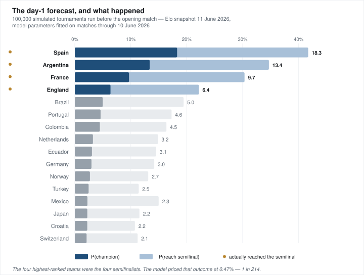
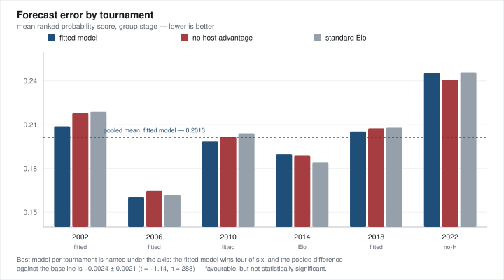
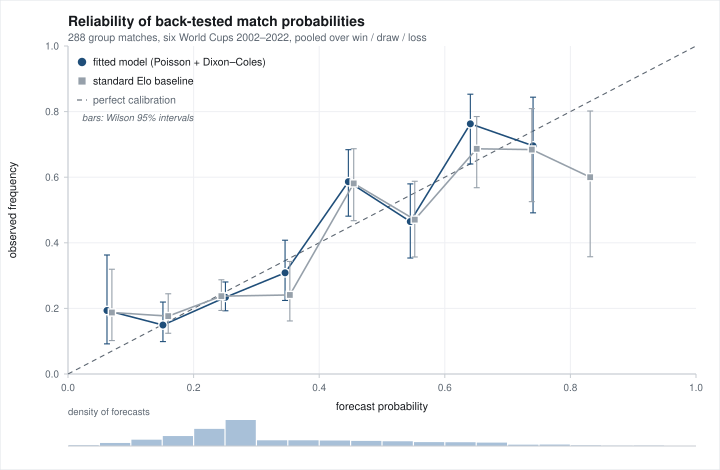

# World Cup 2026 — Calibrated Monte Carlo Tournament Model

A from-scratch probabilistic model of the FIFA World Cup 2026, built to be
*calibrated* rather than merely plausible. Every parameter is estimated by
maximum likelihood from 49,547 international matches, every modelling choice is
tested out-of-sample on the six World Cups from 2002 to 2022, and the results
are reported with paired standard errors rather than cherry-picked wins.

**Pure Python standard library. No numpy, no scipy, no pandas.** The Poisson GLM,
the Newton–Raphson solver, the Fisher-information standard errors and the
likelihood-ratio tests are all implemented directly.

```
python3 fit_goal_model.py     # estimate the model from match history  (~2 min)
python3 backtest.py           # walk-forward validation, 2002-2022     (~3 min)
python3 main.py 100000        # 100k tournament simulations            (~80 s)
python3 make_figures.py       # regenerate the figures below           (instant)
```

Every figure in this README is generated by `make_figures.py`, which emits SVG
directly from the standard library — the same no-dependency rule as the rest of
the repository, applied to the plotting.

---

## The day-1 forecast, and what happened

Before a ball was kicked, the model ranked all 48 teams. Its top four were **Spain,
Argentina, France and England** — and those turned out to be the four semifinalists.
It priced that outcome, in advance, at **1 in 214**.

Here is that forecast. It came from the Elo snapshot of 11 June 2026 and parameters
fitted on matches ending 10 June 2026 — the day before the opening match. That
cutoff is not a claim to be taken on trust, it is recorded in the artefact itself:
`data/goal_model.json` carries `"fit_window_end": "2026-06-10"`. Nothing below saw
a single minute of the tournament. The forecast is preserved verbatim in
`data/day1_forecast.csv` — sealed, seeded (12345), and reproducible with
`python3 main.py 100000` on a `data/results.json` with no scores entered.



The same numbers, with the rounds in between:

| # | team | champion | final | **semifinal** | quarter | advance |
|---:|---|---:|---:|---:|---:|---:|
| **1** | **Spain** ✅ | **18.28%** | 28.35% | 41.71% | 55.17% | 99.2% |
| **2** | **Argentina** ✅ | **13.38%** | 22.54% | 34.69% | 50.17% | 96.5% |
| **3** | **France** ✅ | **9.68%** | 16.99% | 30.33% | 45.75% | 93.3% |
| **4** | **England** ✅ | **6.38%** | 12.17% | 22.18% | 37.49% | 95.6% |
| 5 | Brazil | 4.99% | 9.84% | 19.45% | 34.40% | 93.9% |
| 6 | Portugal | 4.60% | 9.32% | 17.29% | 32.07% | 90.2% |
| 7 | Colombia | 4.47% | 8.77% | 16.37% | 30.57% | 89.4% |
| 8 | Netherlands | 3.23% | 6.85% | 14.86% | 29.28% | 89.4% |
| 9 | Ecuador | 3.06% | 6.62% | 14.53% | 26.49% | 94.3% |
| 10 | Germany | 2.98% | 6.46% | 14.20% | 26.10% | 93.9% |
| 13 | Mexico *(host)* | 2.25% | 5.91% | 14.98% | 36.78% | 95.3% |
| 20 | United States *(host)* | 1.11% | 2.87% | 6.75% | 16.82% | 67.6% |
| 24 | Canada *(host)* | 0.90% | 2.93% | 8.53% | 27.57% | 94.6% |

✅ = reached the semifinals.

Forty-eight teams entered and forty-four of them did not reach the semifinals.
Spain, the day-1 favourite, went on to beat France 2–0 in the first semifinal and
reach the final.

## What that forecast was actually worth

Less than it looks, and the model itself says so. Asked how often all four of its
top-ranked teams reach the semifinals together, it answers:

| outcome | model probability |
|---|---:|
| 0 of the top 4 reach the SF | 18.10% |
| 1 of 4 | 43.33% |
| 2 of 4 | 30.59% |
| 3 of 4 | 7.51% |
| **4 of 4 — what happened** | **0.47%  (1 in 214)** |

Two things follow, and both matter more than the headline:

- **The four events are negatively dependent.** Multiplying the marginals naively
  gives 0.974%, more than twice the true joint probability of 0.468%. These teams
  sit in the same bracket and can eliminate each other — France and Spain in fact
  met in the semifinal — so "all four survive" is strictly harder than independence
  implies. This is the kind of error a marginals-only model makes and a full
  bracket simulation does not.
- **n = 1.** A 1-in-214 event occurring once is not evidence that the model is well
  calibrated. It is one draw from a distribution, and the honest prior is that it
  was mostly luck. The evidence for this model is §3 below — 384 matches, proper
  scoring rules, paired standard errors — and that evidence is *equivocal*. Both results
  are in this README, at the same level of prominence, because reporting only the
  flattering one is how forecasting repositories mislead people.

The host numbers illustrate the model's structure nicely. Mexico ranks **5th** on
P(reach the quarter-finals) at 36.78% but only **13th** on P(champion) at 2.25%: a
108-Elo home bonus is worth a great deal across three group matches and a Round of
32, and very little across seven matches against progressively stronger opposition.

---

## Why this repository might interest you

| | |
|---|---|
| **Joint estimation** | Home advantage and the goal model are estimated *together* by fixed-point iteration, because the Elo replay that produces the covariate depends on the home-advantage parameter being estimated. |
| **Proper scoring throughout** | Ranked Probability Score (the standard for ordered football outcomes), multiclass Brier, log-loss — aggregate metrics only. The single-tournament result above is reported with the model's own price attached and labelled as the anecdote it is. |
| **Strict walk-forward validation** | Parameters are re-fitted on the 10 years ending the *day before* each tournament starts. Ratings are replayed match by match. No information from the future touches any prediction. |
| **Paired inference** | Models are compared on identical matches, so differences are reported as paired means ± SE with *t* statistics — removing the common match-randomness variance that swamps unpaired comparisons. |
| **Honest effect sizes** | The fitted model beats both baselines on every aggregate group-stage metric, and the paired difference is **1.1σ — not significant at n = 288.** That is reported here as prominently as the win. |
| **A live out-of-sample call** | On day 1, before a ball was kicked, the model's four highest-ranked teams were Spain, Argentina, France and England. Those were the four semifinalists — an outcome it priced at **1 in 214**. Reported above with that price attached, and with the n = 1 caveat it deserves. |
| **Exact competition rules** | The full 495-row FIFA Annex C third-place allocation table, validated on load against each match's permitted source groups; FIFA Article 13 tiebreakers with head-to-head mini-tables computed only among currently tied teams. |

---

## 1. The model

### 1.1 Ratings

Team strength is the eloratings.net Elo rating. The win expectancy for a rating
difference $d$ is

$$E(d) = \frac{1}{1 + 10^{-d/400}}$$

Ratings update *inside* every simulated tournament using the site's own rule,

$$\Delta R = K \cdot G(|\text{GD}|) \cdot (W - E),\qquad K = 60 \text{ (WC finals)}$$

with margin multiplier $G = 1$ for a one-goal win, $1.5$ for two, $(11+N)/8$ for
$N \ge 3$. A team on a deep run therefore carries its earned rating into later
rounds, and a match decided on penalties counts as a draw for rating purposes —
matching the official bookkeeping.

### 1.2 Scorelines

Elo gives an expectancy, not a scoreline, and group standings need goals. Each
team's scoring rate is modelled as a log-linear function of the effective rating
difference:

$$\log \lambda_A = \alpha + \beta\, d_{\text{eff}}, \qquad
  \log \lambda_B = \alpha - \beta\, d_{\text{eff}}, \qquad
  d_{\text{eff}} = R_A - R_B + H\,v$$

where $v \in \{-1, 0, +1\}$ encodes who, if anyone, is at home. Scores are drawn
from the resulting bivariate distribution with the **Dixon–Coles** correction
$\tau$ applied to the four low-score cells $\{0,0\},\{0,1\},\{1,0\},\{1,1\}$,
which repairs the well-known underdispersion of independent Poisson at 0–0 and
1–1. Draw probabilities then fall out of the model rather than being assumed.

Three alternative goal models remain selectable via `--goal-model` for
ablation: `regression` (no Dixon–Coles), `elo_total` (empirical total
$T(d) = 2e^{\alpha}\cosh(\beta d)$ split to match $E(d)$ exactly), and
`elo_fixed` (fixed 2.70-goal total — the naive baseline).

### 1.3 Knockout rounds

90 minutes are sampled from the same distribution. A draw goes to 30 minutes of
extra time sampled at one third the rates, then to penalties, modelled as

$$P(\text{A wins the shootout}) = 0.5 + w\,(E(d) - 0.5), \qquad w = 0.25$$

Shootouts are mostly noise, and $w = 0.25$ encodes that explicitly instead of
pretending either that they are coin flips or that they are won by the better
team.

---

## 2. Parameter estimation (`fit_goal_model.py`)

The covariate $d_{\text{eff}}$ is a *pre-match* rating difference, which must be
reconstructed rather than looked up. The estimation pipeline:

1. **Replay the entire Elo history** — 49,547 matches, 1872 to today — under
   eloratings.net rules, with the K-factor keyed off the competition tier
   (60 World Cup, 50 continental, 40 qualifiers/Nations League, 20 friendlies),
   recovering every match's pre-match rating difference.
2. **Restrict to the last 10 years of competitive matches** (friendlies dropped):
   6,860 matches, 2016-06-10 to 2026-06-10.
3. **Fit the Poisson GLM by maximum likelihood** — Newton–Raphson with an
   analytic Hessian, solved by Gaussian elimination with partial pivoting.
4. **Resolve the circularity.** The replay in step 1 needs $H$; the fit in step 3
   *produces* $H = \gamma/\beta$. The two are iterated to a fixed point
   (converges to within 1 Elo point in a handful of iterations).
5. **Test whether home advantage depends on the rating gap** via a likelihood-ratio
   test on a $v \cdot |d|$ interaction, plus bucketed estimates with CIs.
6. **Estimate the World Cup host effect separately** across all host matches.
7. **Fit the Dixon–Coles $\rho$** by profile likelihood (ternary search).
8. **Rescale to the official Elo scale.** The replayed ratings drift from the
   published ones; regressing replayed on official across the 48 finalists gives
   a scale factor of $0.874$, applied to $\beta$ and $H$ before they are written
   out.

Standard errors come from the Fisher information, with the delta method for the
ratio $H = \gamma/\beta$.

### Fitted parameters (`data/goal_model.json`)

| Parameter | Estimate | Interpretation |
|---|---|---|
| $\alpha$ | 0.1740 | log baseline scoring rate — 1.19 goals/team for equals |
| $\beta$ | $1.656 \times 10^{-3}$ | rate response per Elo point |
| $\rho$ | −0.0344 | Dixon–Coles low-score dependence |
| $H$ | **107.6 ± 5.2 Elo** | generic home advantage |
| $H_{\text{host}}$ | **186 ± 34 Elo** | World Cup hosts specifically (1930–2022, era-pooled) |
| $n$ | 6,860 | competitive matches in the fitting window |

Two findings worth stating plainly:

- **Home advantage does not vary with the rating gap.** The interaction test gives
  $\text{LR} = 1.69$ against a $\chi^2_1$ critical value of $3.84$ — not
  significant. A constant $H$ is the right specification, which is not obvious a
  priori and is usually assumed rather than tested.
- **Home advantage is declining.** Re-fitting on each pre-tournament window gives
  $H = 119, 120, 126, 117, 111, 98$ Elo for 2002 → 2022. The classic
  eloratings.net value of 100 sits comfortably inside today's confidence interval;
  the 1990s value does not.

---

## 3. Validation (`backtest.py`)

Six World Cups, 288 group matches and 96 knockout matches, scored under strict
walk-forward discipline: for each tournament, parameters are re-estimated on the
ten years of competitive football ending the day before the opening match, and
ratings are replayed up to each match. Late-tournament predictions see
tournament form; nothing sees the future.

Three models are compared on identical matches:

- **`ours`** — fitted regression + Dixon–Coles + fitted host advantage
- **`noH`** — identical, host advantage forced to zero *(ablation)*
- **`std`** — "standard Elo": raw $E(d)$, no fitted parameters, minimal draw model *(baseline)*



### Group stage — 288 matches, 3-way W/D/L

| model | RPS | Brier | log-loss |
|---|---|---|---|
| **ours** | **0.2013** | **0.5788** | **0.9837** |
| noH | 0.2035 | 0.5832 | 0.9907 |
| std | 0.2037 | 0.5838 | 1.0017 |

**Paired differences (negative favours the first model):**

| comparison | ΔRPS | SE | t | n |
|---|---|---|---|---|
| ours vs std | −0.00238 | 0.00209 | −1.14 | 288 |
| ours vs noH | −0.00211 | 0.00149 | −1.41 | 288 |
| noH vs std | −0.00028 | 0.00137 | −0.20 | 288 |

**The honest read: the fitted model wins on every metric, and none of it is
statistically significant.** At 288 matches the standard error on ΔRPS is the
same order as the effect. The correct conclusion is *"better, and consistent with
noise"* — not *"beats the baseline"*. Reporting it the other way would be the
easiest possible way to make this table look stronger, and would be wrong.

Where the improvement is most visible:

**Draw calibration** — independent Poisson systematically underpredicts draws,
which is exactly the failure Dixon–Coles addresses:

| model | predicted draw rate | observed |
|---|---|---|
| ours | 24.3% | 23.3% |
| noH | 24.4% | 23.3% |
| std | 22.3% | 23.3% |

The full picture across the probability range — each match contributing one point
per possible outcome, binned, with Wilson 95% intervals:



Neither model is meaningfully better *calibrated*. The n-weighted mean absolute
calibration error is 0.0485 for the fitted model against 0.0484 for the baseline,
and most bin deviations sit inside their intervals — which, at 864 points spread
over ten bins, is what one should expect.

**The difference between them is confidence, not reliability.** The baseline
spreads its forecasts markedly wider (sd 0.195 against 0.174) without being any
more often right, and log-loss — which punishes confident errors hardest — is
where that unearned confidence shows up: 1.0017 against 0.9837 overall, widening
to 1.2571 against 1.1218 on the large-gap slice below. The histogram beneath the
panel shows where forecasts actually live: only 3.8% of them exceed 0.70, which
is why that slice is only 24 matches.

**Large rating gaps** (`|d| ≥ 300`, n = 24) — where a raw Elo expectancy is most
overconfident and the fitted floor on the underdog's scoring rate matters most:

| model | RPS | log-loss |
|---|---|---|
| ours | **0.2485** | **1.1218** |
| std | 0.2558 | 1.2571 |

### Knockout stage — 96 matches, P(advance)

| model | Brier | log-loss |
|---|---|---|
| ours | 0.1986 | 0.5810 |
| noH | 0.1987 | 0.5826 |
| std | **0.1976** | **0.5807** |

Here the fitted model is **not** better — the three are statistically
indistinguishable (ours vs std: ΔBrier = +0.0011 ± 0.0066, t = +0.16). Two
knockout rounds' worth of extra-time and shootout machinery buys nothing over a
raw Elo expectancy on this sample. That is a genuine negative result and it is
left in.

Per-match predictions for all 384 matches are written to
`output/backtest_matches.csv` for independent scoring.

---

## 4. Tournament simulation (`main.py`)

The 2026 format is new (48 teams, 12 groups of four, a Round of 32) and its
third-place qualification rule is genuinely intricate. It is implemented exactly,
not approximated:

- **Group ranking** follows FIFA Article 13: points → head-to-head points → h2h
  goal difference → h2h goals → overall GD → overall goals → ranking. The
  head-to-head mini-table is recomputed over *only the currently tied* teams, which
  is the subtle part — a three-way tie that resolves into a two-way tie must be
  re-evaluated among the remaining two.
- **Third-place allocation** uses the complete **Annex C** table: which eight of
  twelve third-placed teams qualify determines the bracket, and there are
  $\binom{12}{8} = 495$ cases. All 495 are present in `data/annex_c.txt` and each
  is validated on load — that the assignment is a permutation of the qualified
  groups, and that every pairing respects its match's permitted source groups.
- **Host advantage is stage-dependent.** Mexico and Canada are at home through the
  Round of 16; from the quarter-finals every match is on US soil, so only the USA
  retains the bonus. Toggle the whole mechanism with `--no-home-advantage`.
- **Conditioning on real results.** Scores entered in `data/results.json` are
  replayed identically in every simulation *including their Elo effect*, so all
  downstream probabilities are properly conditional. Once the group stage is
  complete, the knockout bracket is inferred (standings → Annex C → R32 → …) and
  the fixture list is written back automatically.

Throughput: **~1,250 tournaments/second** single-core (103 matches each,
CPython 3.12, Apple silicon) — 100,000 simulations in about 80 seconds of CPU
time, with no compiled dependencies. Score distributions are cached at 1-Elo
resolution and sampled via a marginal/conditional CDF pair, which reproduces the
exact Dixon–Coles joint rather than an independent approximation.

### Outputs (`output/`)

| file | contents |
|---|---|
| `team_stats.csv` | per team: P(win group), P(advance), P(reach R16/QF/SF/Final), P(champion) |
| `group_match_probs.csv` | every group fixture: P(home win / draw / away win) |
| `knockout_match_probs.csv` | per bracket slot: P(pairing), 90-minute W/D/L, P(advance) |
| `knockout_stats.csv` | per team: expected knockout draws after 90' and shootouts per tournament |
| `backtest_matches.csv` | all 384 historical predictions, all three models |

---

## 5. Usage

```bash
python3 main.py                      # 100,000 simulations (default)
python3 main.py 10000                # fewer, for a quick look
python3 main.py --refetch-elo        # pull current ratings from eloratings.net first
python3 main.py --no-home-advantage  # neutral-ground counterfactual
python3 main.py --goal-model elo_fixed   # ablate to the naive fixed-total model
```

`--refetch-elo` scrapes eloratings.net with a mirror fallback, and on any failure
keeps the existing `data/teams.csv` values and warns — a bad fetch never clobbers
the data.

To condition on real results, edit `data/results.json` and rerun:

```json
{ "group": "A", "home": "Mexico", "away": "South Africa", "score": [2, 0] }
{ "teams": ["Mexico", "Croatia"], "score": [1, 1], "penalties_winner": "Mexico" }
```

Knockout scores are recorded *after* extra time; set `"extra_time": true` when a
match was decided in ET so the 90-minute outcome is correctly booked as a draw.

### Layout

```
main.py                  tournament simulator, format rules, output
fit_goal_model.py        Elo replay, Poisson GLM, home-advantage estimation
backtest.py              walk-forward validation, 2002-2022
make_figures.py          SVG figure generation (stdlib only, no matplotlib)
data/teams.csv           48 finalists: group, draw position, Elo, host flag
data/annex_c.txt         all 495 FIFA Annex C third-place allocations
data/goal_model.json     fitted parameters + provenance
data/results.json        editable real results (conditioning input)
data/day1_forecast.csv   sealed pre-tournament forecast (seed 12345)
output/                  generated CSVs
docs/                    generated figures
```

Set `RNG_SEED` at the top of `main.py` to an integer for reproducible runs.

---

## 6. Known limitations

Stated explicitly, because a model whose limitations are unstated should not be
trusted:

- **Elo is the only strength signal.** No squad quality, no injuries, no player-level
  data, no market prices. A single rating per team cannot know that a key striker
  is out.
- **Teams are stationary within a tournament** apart from Elo updates. No fatigue,
  no rotation ahead of a dead rubber, no motivation effects in settled groups.
- **The host advantage estimate is era-pooled.** $H_{\text{host}} = 186 \pm 34$ Elo
  spans 1930–2022, an era over which generic home advantage measurably declined.
  The simulator therefore uses the contemporary generic $H \approx 108$ by default,
  not the larger historical host figure.
- **Backtest power is limited.** 288 group and 96 knockout matches. The group-stage
  improvement is real in sign and insignificant in size; the knockout result is a
  wash. Six tournaments cannot settle this.
- **The 2026 format has never been played.** The Annex C logic is validated against
  the regulations, not against observed outcomes.
- **Fair-play tiebreakers are not modelled** (disciplinary records are not
  forecastable); the model falls through to rating, then to a random draw of lots.

## Data sources

- **Elo ratings** — [eloratings.net](https://eloratings.net), snapshot 11 June 2026
- **Match history** — [martj42/international_results](https://github.com/martj42/international_results), 49,547 matches, 1872–2026
- **Groups & bracket** — FIFA World Cup 2026 regulations; Final Draw of 5 December 2025 plus March 2026 playoff winners
